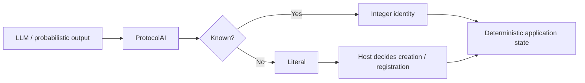

# TheSingularityWorkshop.ProtocolAi

[](https://opensource.org/licenses/MIT)
[](https://www.nuget.org/packages/TheSingularityWorkshop.ProtocolAi)
[](https://www.nuget.org/packages/TheSingularityWorkshop.ProtocolAi)
[](https://github.com/TrentBest/TheSingularityWorkshop.ProtocolAi/actions/workflows/build.yml)
[](https://codecov.io/gh/TrentBest/TheSingularityWorkshop.ProtocolAi)

**The lexicon layer for self-defining, integer-backed AI protocols.**

> **Turn probabilistic language into application-owned identity.**



### Start here

| If you want to... | Go to |
|---|---|
| Install and use the package | **[Consuming ProtocolAI](docs/CONSUMING.md)** |
| See practical patterns | **[ProtocolAI Examples](docs/EXAMPLES.md)** |
| Understand the architecture | [Theory](docs/THEORY.md) |
| Understand the current boundary | [Reflection](docs/REFLECTION.md) |

The fastest path is **install → define a vocabulary → encode known values → handle literals → decode identities**.


AI systems are becoming very good at producing structured data. ProtocolAI asks a different question:

> **What happens when the vocabulary itself becomes compact, addressable, self-describing, and owned by the tool that needs it?**

A tool can define:

```text
[1001] People

[2001] bobId  = "Bob"
[2002] ryanId = "Ryan"
[2003] saraId = "Sara"
[2004] janeId = "Jane"
[2005] jackId = "Jack"
[2006] jillId = "Jill"
```

The model-facing representation can then become:

```text
[2001] [2004] [2006]
```

And when an interaction introduces something new:

```text
[2001] [2004] "New Character"
```

The literal is not a failure. **It is a possible new semantic identity.**

---

## WHAT is this?

ProtocolAI is the **WHAT layer**.

But there is a deeper reason to use it: **ProtocolAI is a funnel for probabilistic data into a nonprobabilistic application representation.**

An LLM is probabilistic. The application does not have to be.

```text
                 PROBABILISTIC
                 model output
                       |
                       v
              +------------------+
              |    ProtocolAI    |
              |  lexical funnel  |
              +------------------+
                 |            |
              known         literal
                 |            |
                 v            v
          integer identity  creation
                 |
                 v
          NONPROBABILISTIC
          application state
```

ProtocolAI does not make the model deterministic. It creates a **deterministic boundary after the model**: once a value is resolved against a tool-owned vocabulary, the application can operate on the identity it owns rather than continuing to interpret free-form language.

It defines a self-describing lexicon without owning the LLM, prompt transport, tokenizer, model, or execution environment.

```text
Tool
 |
 | defines vocabulary
 v
+----------------------+
|      ProtocolAI      |
|        WHAT          |
|                      |
| [1001] People        |
| [2001] Bob           |
| [2002] Jane          |
+----------+-----------+
           |
           v
    AI-facing host
           |
           v
          LLM
```

The package supplies the form of the vocabulary. The tool supplies its meaning.

---

## Why integer-backed?

A string carries meaning directly. An integer can carry **identity**.

ProtocolAI separates:

| Layer | Example | Role |
|---|---|---|
| Protocol identity | `[1001]` | Vocabulary namespace |
| Symbol identity | `[2001]` | Entry address |
| Symbol name | `bobId` | Human-facing identifier |
| Value | `"Bob"` | Human/domain meaning |

The integer is not the meaning.

It is the **address of the meaning**.

That makes it possible to describe a vocabulary once and subsequently exchange compact references to its members.

---

## Known values and new values

The current API deliberately distinguishes known values from literals:

```csharp
var people = new ProtocolBuilder(1001, "People")
    .Define(2001, "bobId", "Bob")
    .Define(2002, "janeId", "Jane")
    .Build();

var payload = people.Encode([
    "Bob",
    "Jane",
    "New Character"
]);
```

Conceptually:

```text
Bob              -> [2001]
Jane             -> [2002]
New Character    -> "New Character"
```

This creates a useful lifecycle:

```text
known value
    |
    v
integer reference

unknown value
    |
    v
literal
    |
    v
creation / registration
    |
    v
future integer reference
```

The alpha does not yet decide how permanent symbol allocation or registration should work. That is an architectural question, not something to hide inside the first version.

---

## Self-definition

A protocol can describe itself:

```csharp
Console.WriteLine(people.Describe());
```

```text
[1001] People
  [2001] bobId = "Bob"
  [2002] janeId = "Jane"
```

The receiving side does not need a hard-coded global dictionary of every domain.

A tool defines its own nomenclature.

That is the key property:

> **ProtocolAI defines the mechanism for defining a lexicon, not the lexicon itself.**

---

## WHAT before HOW

ProtocolAI and GrammarAI are intentionally separate.

ProtocolAI asks:

> **What does this symbol mean?**

GrammarAI asks:

> **How may these symbols be connected?**

```text
ProtocolAI
    |
    | WHAT
    v
GrammarAI
    |
    | HOW
    v
AI-facing host
    |
    v
   LLM
```

ProtocolAI does not need to own grammar construction.

GrammarAI does not need to own the vocabulary it references.

---

## Why this matters now

Current AI platforms increasingly expose structured outputs, schemas, function calling, and constrained generation. OpenAI's current documentation describes Structured Outputs as schema-adherent generation, while its function-calling documentation also describes context-free grammars as a way to constrain model output. [OpenAI Structured Outputs](https://developers.openai.com/api/docs/guides/structured-outputs) and [Function Calling](https://developers.openai.com/api/docs/guides/function-calling)

ProtocolAI sits at a different semantic layer.

```text
schema / grammar
      |
      v
structured representation
      |
      v
ProtocolAI vocabulary
      |
      v
integer-backed references
```

The goal is not to replace JSON Schema or model-specific constrained decoding.

The goal is to explore what happens when **the application's own semantic vocabulary becomes an explicit, addressable protocol**.

---

## What belongs here

ProtocolAI owns:

- protocol identity;
- symbol identity;
- symbolic names;
- human-readable values;
- string-to-integer encoding;
- integer-to-string decoding;
- mixed integer/literal payloads;
- deterministic self-description.

ProtocolAI does not own:

- LLM clients;
- model selection;
- tokenization;
- prompting policy;
- inference;
- transport;
- tool execution;
- grammar composition;
- MicroBundle hosting;
- REST/OpenAPI;
- GUI manifestation.

Those belong to other layers.

---

## Core API

### `ProtocolBuilder`
Defines a vocabulary before publishing its immutable definition.

### `ProtocolDefinition`
Immutable, self-describing protocol definition.

### `ProtocolSymbol`
One named value in the vocabulary.

### `ProtocolReference`
Stable reference to a symbol inside a protocol.

### `ProtocolValue`
Either an integer-backed reference or a literal string.

### `ProtocolPayload`
Ordered values suitable for model-facing protocol transport.

---

## The larger thesis

The intended progression is:

```text
strings
   |
   v
named symbols
   |
   v
integer identities
   |
   v
self-describing vocabulary
   |
   v
grammar
   |
   v
structured protocol
   |
   v
tool / experience
```

ProtocolAI occupies the first major boundary:

**meaning becomes addressable.**

GrammarAI occupies the next:

**addresses become composable.**

---

## Current alpha boundary

**Version: `0.1.0-alpha.1`**

The current release establishes:

- self-defining protocol vocabularies;
- integer-backed symbol identity;
- known-value encoding;
- literal fallback for unknown values;
- integer decoding;
- deterministic protocol descriptions.

It does not yet establish:

- wire-level serialization;
- dynamic symbol registration;
- persistent allocation;
- cross-protocol negotiation;
- compatibility/version negotiation;
- grammar compilation;
- model-specific adapters;
- constrained decoding.

See:

- [ProtocolAI Theory](docs/THEORY.md)
- [ProtocolAI Reflection](docs/REFLECTION.md)

---

## Workshop architecture

ProtocolAI is deliberately independent of FSM execution, REST transport, GUI rendering, and MicroBundle hosting.

```text
             AI / Experience
                    |
          +---------+---------+
          |                   |
      GrammarAI           tool host
          |                   |
      ProtocolAI <------------+
          |
     integer lexicon
          |
     domain meaning
```

The package should remain the **form of the lexicon** rather than becoming a warehouse for every AI integration.

---

## Development

```bash
dotnet restore TheSingularityWorkshop.ProtocolAi.slnx
dotnet build TheSingularityWorkshop.ProtocolAi.slnx --configuration Release
dotnet test tests/ProtocolAi.Tests/ProtocolAi.Tests.csproj --configuration Release
dotnet pack TheSingularityWorkshop.ProtocolAi.csproj --configuration Release --output ./artifacts
```

The public package workflow runs on every push to `master`: it restores, builds, tests with coverage, packs the NuGet artifact, and publishes it through NuGet Trusted Publishing. It can also be dispatched manually.

---

## Documentation

- [Theory](docs/THEORY.md)
- [Reflection](docs/REFLECTION.md)

---

## License

MIT. See [LICENSE.txt](LICENSE.txt).

---

## 🔗 Resources & Support

- **NuGet:** [TheSingularityWorkshop.ProtocolAi](https://www.nuget.org/packages/TheSingularityWorkshop.ProtocolAi)
- **Source:** [GitHub](https://github.com/TrentBest/TheSingularityWorkshop.ProtocolAi)
- **GrammarAI:** [TheSingularityWorkshop.GrammarAi](https://github.com/TrentBest/TheSingularityWorkshop.GrammarAi)
- **FSM_API:** [TheSingularityWorkshop.FSM_API](https://www.nuget.org/packages/TheSingularityWorkshop.FSM_API)
- **MicroBundleDomain:** [TheSingularityWorkshop.MicroBundleDomain](https://github.com/TrentBest/TheSingularityWorkshop.MicroBundleDomain)

<p align="center">
  <a href="https://github.com/TrentBest/FSM_API">
    
  </a>
</p>

<p align="center">
  <em>The Singularity Workshop — Tools for the curious, the bold, and the systemically inclined.</em><br>
  <strong>Because state shouldn't be a mess.</strong>
</p>
