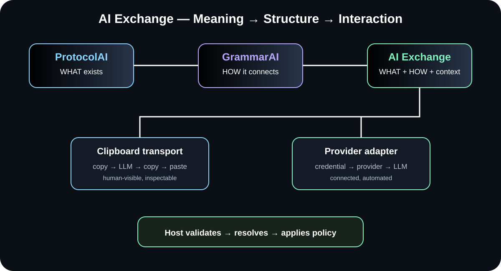

# TheSingularityWorkshop.ProtocolAi

# Give AI an address space for the things your application already knows.

**TheSingularityWorkshop.ProtocolAi** is a small, provider-neutral C# library for defining **self-describing, integer-backed vocabularies**.

It answers a deceptively simple problem:

> **An AI can say "Bob." Your application may need to know exactly which Bob.**

Strings carry meaning.

**Integers can carry identity.**

ProtocolAI gives your application a way to define that identity explicitly, resolve known values deterministically, preserve genuinely new values as literals, and expose the vocabulary itself as protocol data.

~~~text
                         AI / HUMAN LANGUAGE
                                  |
                                  v
                         "Bob", "Jane", "Forge"
                                  |
                                  v
                    +---------------------------+
                    |        ProtocolAI         |
                    |                           |
                    |     WHAT does it mean?   |
                    +-------------+-------------+
                                  |
                    +-------------+-------------+
                    |             |             |
                    v             v             v
                 [2001]        [2002]        [7201]
                    |             |             |
                    v             v             v
                   Bob           Jane          Forge

             known identity             unknown value
                    |                         |
                    v                         v
              integer reference           literal
                    |                         |
                    +------------+------------+
                                 |
                                 v
                       application-owned state
~~~

  

<strong>Language is probabilistic. Meaning can still have an address.</strong>

**ProtocolAI is not an LLM. It is the semantic boundary around the LLM.**

It does not try to make inference deterministic.

It gives the **application** a deterministic vocabulary with which to interpret, address, and carry the things it already owns.

---

## Try it in 60 seconds

You do not need an LLM, an API key, or a framework integration to see the core idea.

Run the executable example already included in this repository:

~~~bash
dotnet run --project examples/ProtocolAi.QuickStart/ProtocolAi.QuickStart.csproj
~~~

It immediately demonstrates the complete alpha boundary:

~~~text
PROTOCOL
[1001] People
  [2001] bobId = "Bob"
  [2002] janeId = "Jane"
  [2003] saraId = "Sara"

PAYLOAD
[2001] [2002] Amelia

KNOWN  [2001]
KNOWN  [2002]
NEW    "Amelia"
~~~

That is the fastest way to understand ProtocolAI: **define what your application owns, resolve what is known, preserve what is new, and let the host decide what happens next.**

If you are consuming the package rather than the repository, the same experiment begins with:

~~~bash
dotnet add package TheSingularityWorkshop.ProtocolAi --version 0.1.0-alpha.1
~~~

Then start with **ProtocolBuilder**, **Encode**, **Decode**, and **Describe**.

The full executable example is at [examples/ProtocolAi.QuickStart](examples/ProtocolAi.QuickStart/README.md).

---

## The idea in 30 seconds

Suppose your tool already knows six people:

~~~text
[1001] People

[2001] bobId  = "Bob"
[2002] ryanId = "Ryan"
[2003] saraId = "Sara"
[2004] janeId = "Jane"
[2005] jackId = "Jack"
[2006] jillId = "Jill"
~~~

The important part is not that the strings exist.

The important part is that **your application owns their identities**.

ProtocolAI lets you resolve those values:

~~~text
"Bob"   -> [2001]
"Jane"  -> [2004]
"Jill"  -> [2006]
~~~

A new value remains visible:

~~~text
"Bob"            -> [2001]
"Jane"           -> [2004]
"Amelia"         -> "Amelia"
~~~

That last case matters.

A vocabulary that cannot encounter anything new is a closed list.

ProtocolAI deliberately leaves the unknown value intact so **the host can decide whether it represents creation, registration, rejection, authorization failure, or something else entirely.**

The current alpha does not make that decision for you.

That is intentional.

---

# Why this exists

AI systems are getting very good at producing structured data.

Modern model platforms can constrain output to schemas, structured objects, and tool/function shapes. That solves an important problem: **shape**. OpenAI, for example, describes Structured Outputs as a way to make model responses adhere to a supplied JSON Schema. Google likewise provides schema-based structured output.

[OpenAI Structured Outputs](https://developers.openai.com/api/docs/guides/structured-outputs) · [Google Gemini structured output](https://ai.google.dev/gemini-api/docs/structured-output)

ProtocolAI asks the next question:

> **Once the shape is correct, who owns the meaning of the values inside it?**

Consider:

~~~json
{
  "person": "Bob",
  "action": "inspect"
}
~~~

That may be perfectly valid JSON.

It may even be perfectly valid according to a strict schema.

But your application still has to answer:

~~~text
Which Bob?
Which action?
Which vocabulary?
Which identity?
Which version of the meaning?
~~~

A schema can tell you that a field is a string.

It does not inherently make that string an **application-owned semantic address**.

ProtocolAI explores that next layer:

~~~text
STRUCTURE
    |
    | schema / grammar
    v
VALID REPRESENTATION
    |
    | ProtocolAI
    v
OWNED VOCABULARY
    |
    v
INTEGER IDENTITY
    |
    v
APPLICATION STATE
~~~

So this project is not an argument against JSON Schema, function calling, or constrained generation.

**It is an argument that structure and semantic identity are different problems.**

---

# The core thesis

ProtocolAI is a **funnel from probabilistic language into deterministic application representation**.

Not because the model becomes deterministic.

It does not.

The model remains probabilistic.

The boundary after the model is where the application can become exact.

~~~text
                 PROBABILISTIC
                 model output
                       |
                       v
              +------------------+
              |    ProtocolAI    |
              |                  |
              |   WHAT / LEXICON |
              +---------+--------+
                        |
                +-------+-------+
                |               |
              known           unknown
                |               |
                v               v
          integer identity    literal
                |               |
                |               v
                |        host-defined policy
                |      create / register / reject
                |               |
                +-------+-------+
                        |
                        v
                 APPLICATION STATE
                   deterministic
~~~

The distinction is important:

**ProtocolAI does not make an LLM deterministic.**

Instead, it creates a deterministic **semantic resolution step** performed by software that already owns the vocabulary.

That is the boundary this package is designed to make explicit.

---

# What does "integer-backed" actually mean?

The integer is not the meaning.

It is the **address of the meaning**.

ProtocolAI separates four things that are often collapsed into one string:

| Layer | Example | Purpose |
|---|---|---|
| Protocol identity | [1001] | Identifies the vocabulary |
| Symbol identity | [2001] | Addresses one entry |
| Symbol name | bobId | Human-facing nomenclature |
| Domain value | "Bob" | Human/domain meaning |

So:

~~~text
[1001]
  |
  +-- [2001] bobId = "Bob"
  +-- [2002] janeId = "Jane"
  +-- [2003] saraId = "Sara"
~~~

The protocol ID gives the namespace.

The symbol ID gives the address.

The value gives the meaning.

The name gives a useful human-facing label.

That separation is the heart of the design.

---

# Why not just use strings?

Because a string is a value.

An identity is a reference.

Those are related, but they are not the same thing.

Imagine an application that already owns:

~~~text
Forge
Research Laboratory
Conference Room
Reception Desk
Landing Pad
~~~

An AI interaction may repeatedly refer to those things.

The application does not need to rediscover what the string means every time.

It already knows.

ProtocolAI lets the application establish:

~~~text
[7200] WorkshopObjects

[7201] forge       = "Forge"
[7202] laboratory  = "Research Laboratory"
[7203] conference  = "Conference Room"
[7204] reception   = "Reception Desk"
[7205] landingPad  = "Landing Pad"
~~~

Then the semantic reference can be represented as:

~~~text
[7201]
[7202]
[7205]
~~~

The application still owns the actual object.

ProtocolAI owns only the **protocol form of its identity**.

That distinction keeps this library small.

---

# Why not just use an enum?

An enum is useful when the vocabulary is:

- known at compile time;
- owned by the codebase;
- stable enough to compile into the application;
- not expected to describe itself dynamically.

ProtocolAI is aimed at a different boundary.

A tool can define its vocabulary as data:

~~~csharp
var people = new ProtocolBuilder(1001, "People")
    .Define(2001, "bobId", "Bob")
    .Define(2002, "janeId", "Jane")
    .Define(2003, "saraId", "Sara")
    .Build();
~~~

The resulting definition is:

- runtime data;
- explicitly identified;
- self-describing;
- independently inspectable;
- usable without a global dictionary baked into the library.

The library does not tell you what "Bob" means.

**You do.**

That is the ownership boundary.

---

# The visual idea

ProtocolAI is deliberately small, but the problem it addresses is easier to understand visually.

  

<em>The semantic boundary: human language becomes addressable application meaning.</em>

  

<em>ProtocolAI separates human-readable values from the integer identities used to address them.</em>

  

<em>The broader architectural direction: WHAT becomes the foundation for the structural layers that follow.</em>

These images are not decoration. They are three views of the same proposition:

> **Meaning becomes addressable.**

If you want the executable version of that proposition instead, jump straight to **[Try it in 60 seconds](#try-it-in-60-seconds)**.

---

# The smallest useful example

Install it:

~~~bash
dotnet add package TheSingularityWorkshop.ProtocolAi
~~~

Define a vocabulary:

~~~csharp
using TheSingularityWorkshop.ProtocolAi;

var people = new ProtocolBuilder(1001, "People")
    .Define(2001, "bobId", "Bob")
    .Define(2002, "janeId", "Jane")
    .Define(2003, "saraId", "Sara")
    .Build();
~~~

Resolve values:

~~~csharp
var payload = people.Encode([
    "Bob",
    "Jane",
    "New Character"
]);

Console.WriteLine(payload);
~~~

Conceptually:

~~~text
[2001] [2002] New Character
~~~

The API distinguishes the cases:

~~~text
"Bob"
   |
   +--> known --> [2001]

"Jane"
   |
   +--> known --> [2002]

"New Character"
   |
   +--> unknown --> literal
~~~

And the application can inspect the result:

~~~csharp
foreach (var value in payload.Values)
{
    if (value.IsReference)
    {
        Console.WriteLine($"Known identity: [{value.SymbolId}]");
    }
    else
    {
        Console.WriteLine($"Literal: {value.Literal}");
    }
}
~~~

That is the current alpha's central operation.

Small API.

Large boundary.

---

# The interesting case is the unknown value

This is where the design becomes more than a dictionary.

Suppose your application knows:

~~~text
[2001] Bob
[2002] Jane
~~~

The model or user introduces:

~~~text
"Amelia"
~~~

ProtocolAI does **not** silently invent an ID.

It does not pretend Amelia already exists.

It preserves:

~~~text
"Amelia"
~~~

Now the host can decide:

~~~text
                 "Amelia"
                    |
                    v
              +-----------+
              |   HOST    |
              +-----------+
               /    |     \
              /     |      \
             v      v       v
          create  reject  authorize
             |
             v
       assign identity
             |
             v
           [2003]
~~~

That creates a clean lifecycle:

~~~text
unknown literal
      |
      v
host policy
      |
      v
new semantic identity
      |
      v
future integer reference
~~~

**ProtocolAI provides the boundary.**

It does not assume the policy.

This is especially important for systems where creation has consequences.

---

# Self-definition

A protocol should be able to tell you what it is.

ProtocolAI therefore makes its vocabulary inspectable:

~~~csharp
Console.WriteLine(people.Describe());
~~~

Produces:

~~~text
[1001] People
  [2001] bobId = "Bob"
  [2002] janeId = "Jane"
  [2003] saraId = "Sara"
~~~

That gives the protocol a useful property:

> **The vocabulary is data, and the vocabulary can describe itself.**

This matters for:

- diagnostics;
- logging;
- protocol inspection;
- tooling;
- documentation generation;
- future serialization;
- future model-host adapters.

The current alpha intentionally stops short of implementing those future transport and persistence layers.

---

# Protocol identity is separate from symbol identity

A symbol does not exist in a vacuum.

ProtocolAI models:

~~~text
protocol
   |
   +-- symbol
   +-- symbol
   +-- symbol
~~~

So a reference can carry both:

~~~csharp
var reference = people.Reference("bobId");

Console.WriteLine(reference.ProtocolId);
Console.WriteLine(reference.SymbolId);
~~~

Conceptually:

~~~text
[1001:2001]
~~~

Which means:

~~~text
protocol [1001]
    symbol [2001]
        = "Bob"
~~~

This gives independently defined vocabularies a namespace boundary.

A "Bob" in one protocol does not have to be the same semantic object as a "Bob" in another.

---

# The WHAT layer

This package has a very deliberate job.

**ProtocolAI answers:**

> **WHAT is this?**

It defines the vocabulary.

It establishes identity.

It resolves known values.

It preserves unknown values.

It describes the vocabulary.

It does not decide what the application does with those identities.

That is the next layer up.

---

# WHAT before HOW

ProtocolAI is designed to sit beside **GrammarAI**.

The separation is intentional:

~~~text
             DOMAIN
               |
               v
        +--------------+
        |  ProtocolAI  |
        |     WHAT     |
        +------+-------+
               |
       owned identities
               |
               v
        +--------------+
        |  GrammarAI   |
        |     HOW      |
        +------+-------+
               |
        legal structure
               |
               v
          AI HOST / TOOL
               |
               v
              LLM
~~~

ProtocolAI asks:

> **What does this symbol mean?**

GrammarAI asks:

> **How may these symbols be connected?**

The host asks:

> **What should the application do with the result?**

Those are three different responsibilities.

Keeping them separate is a feature, not a limitation.

---

# ProtocolAI is deliberately not an AI framework

There is no LLM client in this package.

There is no model selection.

There is no tokenizer.

There is no prompt engine.

There is no inference loop.

There is no vendor SDK.

There is no REST transport.

There is no OpenAPI implementation.

There is no grammar compiler.

There is no tool execution engine.

There is no MicroBundle host.

There is no GUI.

And there should not be.

The purpose of ProtocolAI is to make one boundary extremely clear:

~~~text
        application-owned meaning
                  |
                  v
        +-------------------+
        |    ProtocolAI     |
        |                   |
        |       WHAT        |
        +-------------------+
                  |
                  v
          integer identity
~~~

Everything above and below that boundary can evolve independently.

That is what makes the package useful as infrastructure.

---

# What ProtocolAI gives you

### A self-defining vocabulary

Your application defines the nomenclature.

### Integer-backed identity

Known values can resolve to compact integer references.

### Deterministic resolution

Given the same definition and input value, the same known symbol resolves to the same ID.

### Literal escape hatch

Unknown values remain visible instead of being silently invented.

### Explicit namespaces

Protocol identity and symbol identity can be carried together.

### Mixed payloads

A payload can contain both integer-backed references and literals.

### Provider neutrality

Nothing in the package requires OpenAI, Anthropic, Google, Ollama, or any other model provider.

### A small surface

The package solves the vocabulary problem without becoming an AI framework.

---

# What ProtocolAI does not give you

You still decide:

- how an LLM is called;
- how the vocabulary is presented to a model;
- whether a model is constrained to emit integer references;
- how model output is validated;
- how literals become new identities;
- who is authorized to create identities;
- how identities are persisted;
- how identities are versioned;
- how protocols negotiate compatibility;
- how payloads are serialized on the wire;
- how a resolved identity is executed.

Those are host and ecosystem concerns.

The package is intentionally honest about that boundary.

---

# A useful mental model

Think of ProtocolAI as a **runtime address book for application meaning**.

Not:

~~~text
LLM framework
~~~

Not:

~~~text
database
~~~

Not:

~~~text
JSON replacement
~~~

Not:

~~~text
prompt library
~~~

Instead:

~~~text
                  YOUR DOMAIN
                       |
                       v
              "Bob", "Jane", "Forge"
                       |
                       v
              +-------------------+
              |    ProtocolAI     |
              |                   |
              |  vocabulary + ID  |
              +---------+---------+
                        |
                        v
                 [2001] [2002]
                        |
                        v
                 model / host
                        |
                        v
                 application
~~~

The application remains the authority over meaning.

ProtocolAI gives that authority a formal address space.

---

# Position in the stack

ProtocolAI is deliberately **not** the whole AI stack. It occupies one narrow semantic boundary.

- **FSM_API** — state
- **Warehouse** — ontology and identity
- **ProtocolAI** — addressable terminals / WHAT
- **GrammarAI** — structure / HOW
- **Protocol / host / experience** — composition, execution, and behavior

The important relationship is not merely vertical. Each layer owns a different question.

> **ProtocolAI defines the form of an application-owned lexicon. The domain still owns the meaning.**

This is why the package can remain small and provider-neutral: it does not need to know which model generated the request, how the request is transported, or what the application ultimately does with the identity.

> **Visual note:** the repository currently contains three Gemini-generated JPGs. The fourth requested Gemini image was not present in the repository, so the stack position above uses a clean repository-native SVG named protocol-ai-ecosystem-stack.svg rather than pretending the missing source image exists.

---

# The larger architectural experiment

The intended progression is:

~~~text
human/domain language
          |
          v
    self-defining
       lexicon
          |
          v
   integer identity
          |
          v
      grammar
          |
          v
     protocol
          |
          v
   tool execution
          |
          v
      experience
~~~

ProtocolAI occupies the first major semantic boundary:

> **Meaning becomes addressable.**

GrammarAI occupies the next:

> **Addresses become composable.**

The eventual protocol layer can then answer:

> **What is the complete interaction?**

And the host can finally answer:

> **What should happen?**

That progression is the reason this package exists.

---

# A note about structured outputs

If you are already using structured output, you do not need to throw it away.

In fact, ProtocolAI can sit inside a structured-output architecture.

For example, a host could conceptually expose:

~~~text
schema
  |
  +-- action
  +-- target
  +-- value
          |
          v
      ProtocolAI
          |
          +-- action vocabulary
          +-- target vocabulary
          +-- value vocabulary
~~~

The schema defines the shape.

ProtocolAI defines the application's vocabulary.

A future GrammarAI layer can define how those vocabulary elements may be arranged.

This distinction is the important part:

~~~text
SHAPE
  -> schema

WHAT
  -> ProtocolAI

HOW
  -> GrammarAI

WHAT TO DO
  -> application / tool
~~~

ProtocolAI is therefore complementary to structured generation rather than a replacement for it. Current model platforms already provide strong mechanisms for schema-constrained output; this library explores the semantic identity layer that can exist inside or beside those structures.

---

# The current alpha is intentionally small

**Current version: 0.1.0-alpha.1**

The release establishes:

- self-defining protocol vocabularies;
- protocol identity;
- symbol identity;
- symbolic names;
- human-readable values;
- known-value encoding;
- integer-backed references;
- literal fallback for unknown values;
- integer decoding;
- deterministic protocol descriptions;
- ordered mixed reference/literal payloads.

It intentionally does **not** yet establish:

- wire-level serialization;
- dynamic symbol registration;
- persistent identity allocation;
- protocol version negotiation;
- compatibility negotiation;
- cross-protocol negotiation;
- grammar compilation;
- constrained decoding;
- model-specific adapters;
- automatic LLM integration.

Those are future layers, not promises hidden behind the alpha label.

---

# The core API

The public surface is deliberately small.

### ProtocolBuilder

Defines a vocabulary before publishing its immutable definition.

### ProtocolDefinition

The immutable, self-describing vocabulary.

### ProtocolSymbol

One named value in the vocabulary.

### ProtocolReference

The explicit relationship between a protocol identity and a symbol identity.

### ProtocolValue

One payload value: either an integer-backed reference or a literal.

### ProtocolPayload

An ordered collection of protocol values.

The complete consumption path is essentially:

~~~text
ProtocolBuilder
      |
      v
ProtocolDefinition
      |
      +--> Encode(...) --> ProtocolPayload
      |
      +--> Reference(...) --> ProtocolReference
      |
      +--> Decode(...) --> domain value
      |
      +--> Describe() --> self-description
~~~

That is the package.

The architecture around it is where the larger experiment begins.

---

# When should you use ProtocolAI?

ProtocolAI is worth exploring when your application:

- already owns a domain vocabulary;
- needs AI to interact with that domain;
- wants identities separated from human-readable values;
- wants runtime-defined vocabularies rather than only compile-time enums;
- needs known values and genuinely new values to be distinguishable;
- wants the vocabulary to describe itself;
- wants a provider-neutral semantic layer;
- expects that vocabulary to eventually participate in a larger protocol.

You probably do **not** need ProtocolAI if you simply need:

- ordinary JSON serialization;
- a conventional DTO;
- a compile-time enum;
- a one-off LLM prompt;
- a model client;
- a standard schema validator.

ProtocolAI is for the boundary where those mechanisms stop answering the deeper question:

> **Who owns the identity of the thing the model is talking about?**

---

# Start using it

Install:

~~~bash
dotnet add package TheSingularityWorkshop.ProtocolAi
~~~

Then:

~~~csharp
using TheSingularityWorkshop.ProtocolAi;

var people = new ProtocolBuilder(1001, "People")
    .Define(2001, "bobId", "Bob")
    .Define(2002, "janeId", "Jane")
    .Define(2003, "saraId", "Sara")
    .Build();

var payload = people.Encode([
    "Bob",
    "Jane",
    "New Character"
]);

Console.WriteLine(payload);
~~~

Explore the definition:

~~~csharp
Console.WriteLine(people.Describe());
~~~

Resolve an identity:

~~~csharp
var bob = people.Decode(2001);
~~~

Or obtain an explicit reference:

~~~csharp
var reference = people.Reference("bobId");
~~~

For a longer consumption walkthrough:

**[Consuming ProtocolAI](docs/CONSUMING.md)**

For patterns and examples:

**[ProtocolAI Examples](docs/EXAMPLES.md)**

For the deeper architectural argument:

**[ProtocolAI Theory](docs/THEORY.md)**

For the current alpha boundary:

**[ProtocolAI Reflection](docs/REFLECTION.md)**

---

# The question ProtocolAI is asking

The interesting question is not:

> "Can an LLM output JSON?"

It clearly can, and modern AI platforms provide increasingly strong mechanisms for schema-constrained output.

The interesting question is:

> **What happens when the application stops treating language as the identity of the things it owns?**

What if:

~~~text
"Bob"
~~~

becomes:

~~~text
[2001]
~~~

What if:

~~~text
[2001]
~~~

is meaningful because:

~~~text
[1001] People
~~~

defines the vocabulary?

What if the vocabulary can describe itself?

What if a new value remains a literal until the host deliberately gives it identity?

What if those identities can later become the terminals of a grammar?

What if the resulting grammar becomes a protocol?

That is the direction.

**ProtocolAI is the first boundary.**

---

# The Singularity Workshop

ProtocolAI is part of a larger family of deliberately separated infrastructure packages.

~~~text
                    EXPERIENCE
                        |
                        v
                  protocol layer
                        |
                        v
                    GrammarAI
                        |
                        v
                   ProtocolAI
                        |
             +----------+----------+
             |                     |
        domain meaning        integer identity
             |                     |
             +----------+----------+
                        |
                        v
                   application
~~~

The principle is consistent:

> **Infrastructure provides the form. The domain provides the meaning.**

ProtocolAI provides the form of an application-owned lexicon.

Your tool provides the meaning.

That separation is the point.

---

  

<strong>One semantic exchange. Clipboard when you want it. Direct provider interaction when you want it.</strong>

## Documentation

- **[Consuming ProtocolAI](docs/CONSUMING.md)** — installation and practical use
- **[ProtocolAI Examples](docs/EXAMPLES.md)** — concrete patterns
- **[ProtocolAI Theory](docs/THEORY.md)** — the semantic boundary and architectural thesis
- **[ProtocolAI Reflection](docs/REFLECTION.md)** — current limitations and open questions
- **[GrammarAI](https://github.com/TrentBest/TheSingularityWorkshop.GrammarAi)** — the structural HOW layer
- **[AI Exchange](docs/AI_EXCHANGE.md)** — provider-neutral clipboard and connected interaction boundary

---

## Development

~~~bash
dotnet restore TheSingularityWorkshop.ProtocolAi.slnx
dotnet build TheSingularityWorkshop.ProtocolAi.slnx --configuration Release
dotnet test tests/ProtocolAi.Tests/ProtocolAi.Tests.csproj --configuration Release
dotnet pack TheSingularityWorkshop.ProtocolAi.csproj --configuration Release --output ./artifacts
~~~

The public workflow restores, builds, tests with coverage, packs the NuGet artifact, and publishes through NuGet Trusted Publishing. It can also be dispatched manually.

---

## License

MIT. See [LICENSE.txt](LICENSE.txt).

---

## Resources

- **[NuGet](https://www.nuget.org/packages/TheSingularityWorkshop.ProtocolAi)** — install the package
- **[GitHub](https://github.com/TrentBest/TheSingularityWorkshop.ProtocolAi)** — source and issues
- **[GrammarAI](https://github.com/TrentBest/TheSingularityWorkshop.GrammarAi)** — structural composition
- **[FSM_API](https://www.nuget.org/packages/TheSingularityWorkshop.FSM_API)** — state abstraction
- **[MicroBundleDomain](https://github.com/TrentBest/TheSingularityWorkshop.MicroBundleDomain)** — compositional domain infrastructure

  

  <em>The Singularity Workshop — Tools for the curious, the bold, and the systemically inclined.</em> 
  <strong>Because state shouldn't be a mess.</strong>

