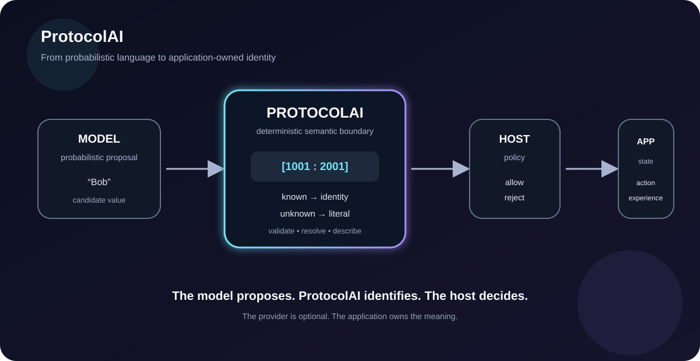

# TheSingularityWorkshop.ProtocolAi

[](https://opensource.org/licenses/MIT)
[](https://www.nuget.org/packages/TheSingularityWorkshop.ProtocolAi)
[](https://www.nuget.org/packages/TheSingularityWorkshop.ProtocolAi)
[](https://github.com/TrentBest/TheSingularityWorkshop.ProtocolAi/actions/workflows/build.yml)
[](https://codecov.io/gh/TrentBest/TheSingularityWorkshop.ProtocolAi)

> ## ProtocolAI is **for AI**, not AI.
>
> **The model proposes. ProtocolAI identifies. The host decides.**

<p align="center">
  
</p>

TheSingularityWorkshop.ProtocolAi is a small, provider-neutral .NET library for giving **application-owned meaning a deterministic address space**.

It does not contain an AI model, provider SDK, prompt engine, API-key handling, HTTP client, grammar compiler, GUI, or command executor.

### The idea in one picture

```text
probabilistic language
        |
        v
   candidate value
        |
        v
   +-----------+
   | ProtocolAI|
   |   WHAT    |
   +-----+-----+
         |
    +----+----+
    |         |
 known     unknown
    |         |
    v         v
identity    literal
    |         |
    +----+----+
         |
         v
     host policy
         |
         v
 application state
```

ProtocolAI does **not** make the model deterministic. It makes the application's semantic boundary deterministic **after** model interaction.

---

## Start here: 60 seconds

### 1. Install

Current alpha target:

```bash
dotnet add package TheSingularityWorkshop.ProtocolAi --version 0.1.0-alpha.3
```

### 2. Define application-owned meaning

```csharp
using TheSingularityWorkshop.ProtocolAi;

var people = new ProtocolBuilder(1001, "People")
    .Define(2001, "bobId", "Bob")
    .Define(2002, "janeId", "Jane")
    .Define(2003, "saraId", "Sara")
    .Build();
```

Your application owns the meaning. ProtocolAI gives that meaning deterministic identity.

### 3. Encode mixed values

```csharp
var payload = people.Encode([
    "Bob",
    "Jane",
    "New Character"
]);
```

Conceptually:

```text
"Bob"           -> [2001]
"Jane"          -> [2002]
"New Character" -> literal
```

Known values become references. Unknown values remain visible rather than silently receiving an identity.

### 4. Validate and resolve

```csharp
people.Validate(payload);

var values = people.Resolve(payload);
```

The receiving application decides what a valid identity is allowed to do.

### 5. Carry the payload across a boundary

Alpha 3 adds a provider-neutral JSON representation:

```csharp
var json = ProtocolPayloadJson.Serialize(payload);

var received = ProtocolPayloadJson.Deserialize(json);

people.Validate(received);

var resolved = people.Resolve(received);
```

See **[the Alpha 3 JSON wire-format specification](docs/PROTOCOL_PAYLOAD_JSON.md)**.

---

## Why this exists

AI systems are good at producing probable language. Applications often need **authoritative identity**.

If an application already knows:

```text
Bob = symbol 2001
```

then a model response containing "Bob" should not automatically become application identity merely because the string looks right.

ProtocolAI makes that boundary explicit.

### Shape is not meaning

A schema can establish that:

```json
{"person":"Bob","action":"inspect"}
```

contains a string called `person`.

It does not, by itself, establish which application-owned identity that string represents.

ProtocolAI addresses **semantic identity**, not merely structure.

```text
shape
  |
  v
structured value
  |
  v
application-owned identity
  |
  v
host policy
  |
  v
application state
```

---

## The core API

| Type | Responsibility |
|---|---|
| `ProtocolBuilder` | Define an application-owned vocabulary |
| `ProtocolDefinition` | Immutable vocabulary and resolution rules |
| `ProtocolSymbol` | One named value and its integer identity |
| `ProtocolReference` | Protocol + symbol identity together |
| `ProtocolValue` | Either a reference or a literal |
| `ProtocolPayload` | Ordered values belonging to one protocol |
| `ProtocolPayloadJson` | Provider-neutral JSON transport for payloads |

The central flow:

```text
ProtocolBuilder
      |
      v
ProtocolDefinition
      |
      +--> Encode(...)    -> ProtocolPayload
      +--> Validate(...)
      +--> Resolve(...)   -> application values
      +--> Reference(...) -> ProtocolReference
      +--> Decode(...)    -> application value
      +--> Describe(...)  -> self-description
```

The integer is **not** the meaning.

It is the address of meaning owned by the application.

---

## Known, unknown, invalid

This distinction is fundamental.

Suppose a protocol knows:

```text
[2001] Bob
[2002] Jane
```

and receives:

```text
"Amelia"
```

ProtocolAI can preserve Amelia as a literal.

The host can then choose to:

- create a new object;
- propose or allocate a new symbol;
- reject it;
- ask for clarification;
- retain it as transient data.

An invalid reference is different:

```text
[9999]
```

If symbol 9999 is not defined by the expected protocol, validation can reject it.

So:

```text
known + valid       -> deterministic identity
unknown + literal   -> host policy
invalid reference   -> validation failure
```

ProtocolAI deliberately does not collapse those states.

---

## Alpha 3: a real capability release

Alpha 2 established:

- integer-backed vocabularies;
- protocol-qualified identity;
- known-value encoding;
- literal preservation;
- deterministic self-description;
- ordered mixed payloads;
- validation;
- resolution.

**Alpha 3 adds a portable transport boundary:**

- dependency-free JSON serialization;
- JSON deserialization with structural validation;
- round-trip preservation of references and literals;
- explicit documentation of the wire representation.

The conceptual progression is:

```text
Alpha 2
vocabulary
    -> deterministic identity
    -> validation
    -> resolution

Alpha 3
vocabulary
    -> deterministic identity
    -> portable payload
    -> validation
    -> resolution
```

Alpha 3 still deliberately excludes provider SDKs, credentials, HTTP/WebSocket clients, dynamic identity allocation, negotiation, grammar compilation, command execution, and GUI behavior.

Those belong above ProtocolAI.

---

## ProtocolAI + GrammarAI

The Workshop keeps the two ideas separate:

```text
ProtocolAI
    WHAT does this identity mean?

GrammarAI
    HOW may identities be organized?

Host
    WHAT should happen?

FSM_COS
    HOW are capabilities composed?
```

ProtocolAI should not become GrammarAI, an AI provider, or an execution engine.

See the [GrammarAI repository](https://github.com/TrentBest/TheSingularityWorkshop.GrammarAi) for the structural companion.

---

## AI exchange without provider lock-in

ProtocolAI can sit between an application and:

- a human;
- clipboard exchange;
- a hosted LLM;
- a local model;
- a future provider adapter;
- deterministic test code.

The provider is not the protocol.

```text
application vocabulary
        |
        v
    ProtocolAI
        |
        v
 semantic exchange
        |
   +----+----+
   |         |
clipboard  provider
   |         |
   +----+----+
        |
        v
       LLM
        |
        v
ProtocolAI validation + resolution
        |
        v
     host policy
```

Provider adapters can own credentials, endpoints, model selection, and provider-specific transport without taking ownership of application semantics.

Read **[AI Exchange](docs/AI_EXCHANGE.md)** for the architectural boundary.

---

## When should you use it?

ProtocolAI is a good fit when your application:

- already owns a domain vocabulary;
- needs an external participant to refer to that vocabulary;
- wants runtime-defined identities rather than only compile-time enums;
- needs known values and genuinely new values to remain distinguishable;
- needs deterministic validation before acting on external data;
- wants a provider-neutral semantic foundation.

It is probably unnecessary for:

- an ordinary DTO;
- a normal enum;
- a one-off JSON document;
- conventional schema validation;
- an application with no stable vocabulary to expose.

Do not add ProtocolAI merely because the word "AI" appears in a feature.

---

## What ProtocolAI is not

ProtocolAI is not:

- an LLM;
- an AI provider;
- a prompt framework;
- a schema validator;
- a JSON replacement;
- a database;
- a grammar compiler;
- a command executor;
- a GUI framework;
- a MicroBundle host.

That restraint is intentional.

> **ProtocolAI provides the deterministic WHAT layer.**

---

## Documentation: leave nothing unexplained

ProtocolAI is intentionally small.

**The documentation should not be.**

The Workshop documentation is organized as a learning path rather than a pile of reference pages:

| Start here | What you get |
|---|---|
| **[Idiot's Guide](docs/IDIOTS_GUIDE.md)** | The idea in plain English, with no prior AI or protocol knowledge required |
| **[Beginner's Guide](docs/BEGINNERS_GUIDE.md)** | Build, encode, validate, resolve, and transport |
| **[C# Developer's Guide](docs/CSHARP_GUIDE.md)** | .NET idioms, API contracts, testing, errors, and integration |
| **[Developer's Guide](docs/DEVELOPERS_GUIDE.md)** | Protocol design, compatibility, ownership, and architecture |
| **[AI Exchange](docs/AI_EXCHANGE.md)** | Provider-neutral semantic exchange |
| **[Examples](docs/EXAMPLES.md)** | Concrete patterns |
| **[Theory](docs/THEORY.md)** | The deeper architectural argument |
| **[Reflection](docs/REFLECTION.md)** | Limitations, lifecycle, and unanswered questions |
| **[Ecosystem Integration](docs/ECOSYSTEM_INTEGRATION.md)** | Boundaries with Workshop packages |
| **[Consuming ProtocolAI](docs/CONSUMING.md)** | Practical package-consumer reference |
| **[Alpha 3 JSON Specification](docs/PROTOCOL_PAYLOAD_JSON.md)** | Exact payload transport semantics |

Every public API should eventually answer:

1. What is it?
2. Why does it exist?
3. When should I use it?
4. What does it deliberately not do?
5. What happens when input is unknown, invalid, or owned by another protocol?

---

## Development

For contributors:

```bash
dotnet restore TheSingularityWorkshop.ProtocolAi.slnx
dotnet build TheSingularityWorkshop.ProtocolAi.slnx --configuration Release
dotnet test TheSingularityWorkshop.ProtocolAi.slnx --configuration Release
dotnet pack TheSingularityWorkshop.ProtocolAi.csproj --configuration Release --output ./artifacts
```

CI builds, tests with Cobertura coverage, reports to Codecov, and produces the package artifact.

**NuGet publication is deliberately disabled by default.**

This documentation pass does not authorize publication.

---

<p align="center">
  <a href="https://github.com/TrentBest/FSM_API">
    
  </a>
</p>

<p align="center">
  <em>The Singularity Workshop — Tools for the curious, the bold, and the systemically inclined.</em><br>
  <strong>Because state shouldn't be a mess.</strong>
</p>
